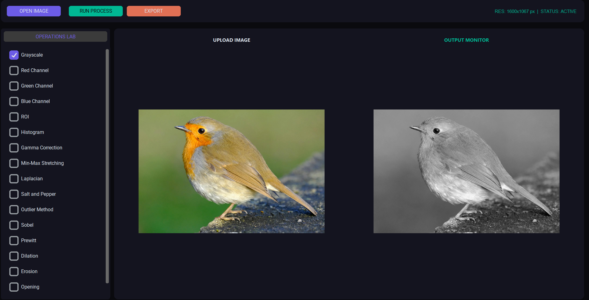

# AuraVision - Advanced Image Processing Suite 👁️✨

A modern desktop application built with Python, OpenCV, and CustomTkinter designed for digital image processing, spatial filtering, morphological transformations, and edge detection.

---

## 🎨 Features

- **Modern Dark-Mode Interface**: Built using `CustomTkinter` for a clean, user-friendly desktop experience.
- **Color Channel Processing**: Extract standalone Red, Green, and Blue channels or convert images to Grayscale.
- **Region of Interest (ROI)**: Custom bounding-box tool for precise image cropping via specific coordinate inputs.
- **Image Enhancement & Analysis**:
  - Histogram calculation & visualization.
  - Gamma Correction.
  - Min-Max Contrast Stretching.
- **Noise Reduction & Filtering**:
  - Median Blur (Salt & Pepper noise removal).
  - Outlier Threshold Method for spatial filtering.
- **Edge Detection Operators**:
  - Sobel Filter.
  - Prewitt Filter.
  - Laplacian Operator.
- **Morphological Operations**:
  - Dilation & Erosion.
  - Opening & Closing.
- **Export & File Handling**: Easily load common image formats (`PNG`, `JPG`, `BMP`) and save processed streams with preserved quality.

---

## 🛠️ Tech Stack & Requirements

- **Language**: Python 3.x
- **GUI Framework**: CustomTkinter, Tkinter, Pillow (PIL)
- **Computer Vision & Math**: OpenCV (`cv2`), NumPy, Matplotlib

---

## 🚀 Getting Started

### 1. Installation
Clone the repository and install the necessary dependencies using `pip`:

```bash
pip install opencv-python numpy Pillow customtkinter matplotlib
